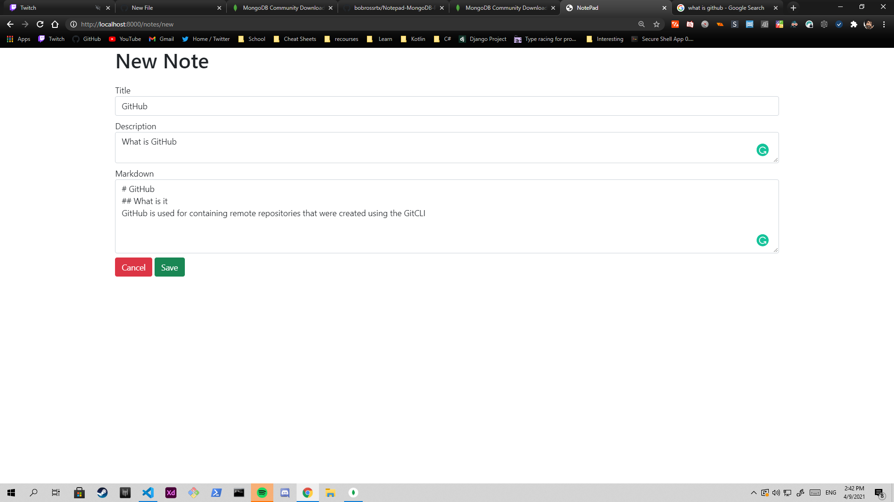

# Notepad

## Setup:
- Fork / Clone the project `git clone https://github.com/bobrossrtx/Notepad-MongoDB-Project.git`
- Install MongoDB Server, [MongoDB Server + Compass](https://www.mongodb.com/try/download/community)
- Setup MongoDB Server (For localhost, select local (Project Default = local))
- Connect to a MongoDB Cluster
- Run (npm run devStart | yarn devStart)

## Images

